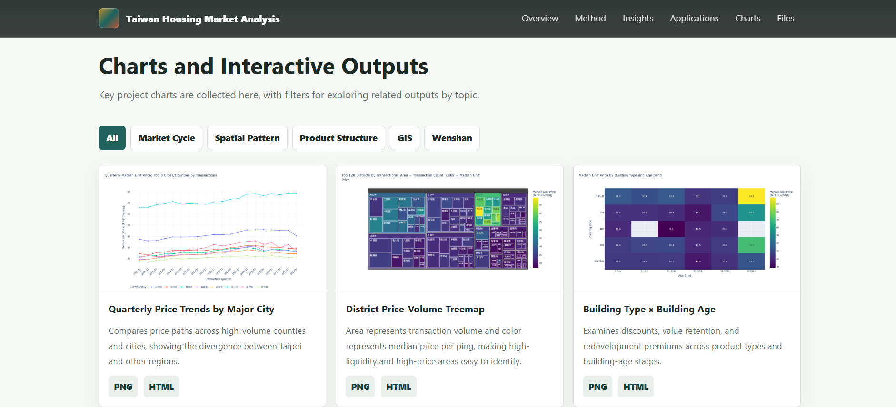

# Data-Driven Taiwan Housing Market Analysis

This repository is the GitHub Pages deliverable for a data-driven Taiwan residential real estate market analysis. The public site summarizes findings from 2021Q1 to 2025Q4 actual price registration records, including market-cycle changes, district-level price-volume structure, product effects, GIS patterns, and the Wenshan District case study.

## GitHub Pages Entry Points

- [index.html](https://heng1222.github.io/taiwan-housing-market-analysis/): Main static results page.
- [profile_report.html](profile_report.html): EDA profile generated by ydata-profiling.
- [img](img): Exported PNG and HTML chart assets used by the static page.
- [main.ipynb](main.ipynb): Main python code.

## How to Open the Project

This repository can be opened either as a static GitHub Pages site or as the source notebook project.

- Static site: open `index.html` directly in a browser, or run `python -m http.server 8000` from the repository root and visit `http://localhost:8000/`.
- EDA report: open `profile_report.html` directly in a browser.
- Notebook workflow: run `jupyter lab main.ipynb` or `jupyter notebook main.ipynb` from the repository root so relative paths such as `data/` and `img/` resolve correctly.
- Python packages: install the notebook dependencies before rerunning the analysis, for example `pip install jupyter pandas numpy plotly matplotlib wordcloud ydata-profiling scikit-learn xgboost`.
- Generated chart assets should remain under `img/` because `index.html` references that folder.

## Data Collection and Placement

Raw data is kept locally under `data/`. The current `.gitignore` intentionally excludes the raw data folders from the public GitHub Pages deliverable.

### Actual Price Registration CSVs

1. Download quarterly residential real estate transaction CSV files from the Ministry of the Interior actual price registration bulk open data service: <https://plvr.land.moi.gov.tw/DownloadOpenData>.
2. Create one folder per quarter under `data/` using ROC year and quarter format, for example `data/110-1` for 2021Q1 and `data/114-4` for 2025Q4.
3. Unzip each quarterly package and place the county/city CSV files directly in the matching folder. Keep the original `*_lvr_land_a.csv` filenames, for example `data/110-1/a_lvr_land_a.csv`.
4. This project expects quarters from 2021Q1 to 2025Q4, which correspond to `data/110-1` through `data/114-4`. Missing quarter folders or empty quarter folders will stop the notebook data-loading step.
5. Do not rename the raw CSV columns. `main.ipynb` reads every `*.csv` in each quarter folder, skips the second header row, and derives year, quarter, and city from the folder and filename.

### Address and GIS Data

- OpenAddresses ZIP files used for address matching should be placed at:
  - `data/openaddresses/tw_tpe_regionwide.zip`
  - `data/openaddresses/tw_nwt_regionwide.zip`
- The GIS script and notebook also use local cache files when available:
  - `data/address_coordinate_cache.csv`
  - `data/township_centroid_cache.csv`
- Rebuilt maps and charts should be exported back to `img/` so the static page can load them.

## Key Findings

- Taiwan's national residential market reached a price peak around 2024Q4, then moved into a price-volume correction after 2024Q3 selective credit controls.
- Taipei City remained more price-resilient than the national market, showing clear core-asset stickiness.
- High transaction volume and high price premiums cluster in different places: New Taipei, Taoyuan, and Kaohsiung carry liquidity, while Taipei and Zhubei show stronger price premiums.
- Building age does not behave as simple linear depreciation; older homes in core districts can carry redevelopment land value.
- Floor level and building type interact, especially in walk-up apartments where middle floors show a clearer price advantage.
- Greater Taipei GIS maps reveal sharp block-level price differences and help validate that non-residential samples were removed.
- Wenshan District continued to rise during the broader correction period, showing submarket divergence inside Taipei.

## Deployment Notes

For GitHub Pages, set the source to the repository root on the target branch. The included `.gitignore` is an allowlist so `git add .` stages only the public static site files listed above.
